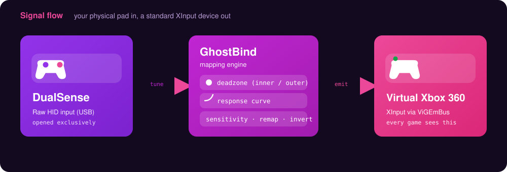
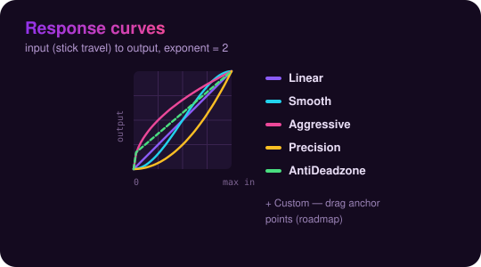

<div align="center">


[](LICENSE)
[](https://dotnet.microsoft.com/download)
[](#-requirements)
[](#-roadmap)

</div>

> A free, modern alternative to reWASD for DualSense (PS5) controllers on Windows 10/11. Translates your DualSense into a virtual Xbox 360 controller so every game sees a standard XInput device — with a live-tunable WPF GUI for deadzones, response curves, sensitivity, and button remapping.

<div align="center">

### Free. No telemetry. No subscription. No background bloat.

</div>

<div align="center">



</div>

---

## ✨ Features

- 🎮 **DualSense → Xbox 360 (XInput)** — games see a plain Xbox controller, no special support required
- 🕹️ **Per-stick tuning** — inner/outer deadzones, sensitivity, axis inversion, and five response curves (Linear / Smooth / Aggressive / Precision / AntiDeadzone) plus a custom exponent
- 🎯 **Trigger shaping** — deadzone, saturation, and curve, with a live bar
- 🔀 **Button remapping** — map any DualSense input to any Xbox 360 output, or to *None* to disable
- 🖱️ **Touchpad** — live finger tracking with configurable sensitivity
- 💡 **Lighting** — override the lightbar with a custom color
- 📦 **Game-ready presets** — curated, tuned profiles you can load in one click
- 🗂️ **Profiles** — save/load/create/delete JSON profiles, swappable on the fly
- 🔄 **Per-game auto-switch** — bind a profile to a game's executable
- 📊 **Live dashboard** — see raw vs. processed stick output, trigger bars, and button highlights in real time
- ⚙️ **Headless CLI** — run the bridge with no UI for testing, scripting, or servers

<div align="center">



</div>

> The five built-in curves (plus a draggable **Custom** curve on the roadmap) reshape how stick travel maps to output. **Aggressive** snaps off-center for fast aiming; **Precision** keeps the center fine for slow tracking; **Smooth** eases both ends; **AntiDeadzone** boosts the low end past games that swallow it. Every shape is previewed live on each stick card.

---

## 📦 Requirements

| Requirement | Notes |
| --- | --- |
| **Windows 10 / 11** | — |
| **[.NET 8 SDK](https://dotnet.microsoft.com/download)** | Required to build and run |
| **[ViGEmBus driver](https://github.com/nefarius/ViGEmBus/releases)** | **Required** — creates the virtual Xbox 360 controller |
| **[HidHide driver](https://github.com/nefarius/HidHide/releases)** | *Optional* — GhostBind already opens the DualSense in exclusive mode, so most games can't see the physical pad. Install HidHide only if a specific game still detects it. |
| **DualSense controller (USB)** | Bluetooth is on the roadmap |

---

## 🚀 Quick Start

Launch the GUI:

```powershell
dotnet run --project src\GhostBind.App
```

Run the headless CLI bridge (no UI — great for testing, scripting, or a server box):

```powershell
dotnet run --project src\GhostBind.Cli
```

> Tip: the CLI also supports `--diag-buttons` to log microswitch chatter with millisecond timestamps. Run it with the GUI stopped, since the app holds the HID handle exclusively.

---

## 🎛️ GUI Tour

| Page | What it does |
| --- | --- |
| **Dashboard** | Live stick visualization (gray = raw, accent = post-processing), trigger bars, button highlights. The "is it working?" page. |
| **Sticks** | Per-stick inner/outer deadzone, sensitivity, response curve, curve exponent, and axis inversion — with a live preview on each card. |
| **Triggers** | Deadzone, saturation, and curve, with a live bar. |
| **Buttons** | DualSense → Xbox 360 mapping grid. Set any source to a different output, or to *None* to disable. |
| **Touchpad** | Live finger positions and sensitivity. |
| **Lighting** | Override the lightbar with a custom color. |
| **Presets** | Curated, game-ready profiles you can load instantly. |
| **Tuning Guide** | In-app walkthrough for dialing in curves and presets. |
| **Profiles** | Save / load / create / delete JSON profiles in `%AppData%\GhostBind\Profiles\`. |
| **Auto-Switch** | Bind a profile to a game's executable for automatic switching. |
| **Settings** | Service status, restart/stop, and links to dependency installers. |

---

## 🔧 How It Works

GhostBind sits between your physical pad and the games that read it — see the **signal-flow diagram** at the top of this README.

1. **Read** — `GhostBind.Core` opens the DualSense over USB **exclusively** via HID, so games can't grab the raw pad directly.
2. **Tune** — the mapping engine applies your profile: inner/outer deadzones, the selected response curve (with exponent), sensitivity, axis inversion, trigger shaping, and button remaps.
3. **Emit** — the processed state is written to a **virtual Xbox 360 controller** created by [ViGEmBus](https://github.com/nefarius/ViGEmBus). Every game just sees a standard XInput device.

Because the output is plain XInput, **no per-game support is required** — if a title works with an Xbox controller, it works with your tuned DualSense. Exclusive HID access hides the physical pad from most games on its own; **HidHide** is only needed for the stubborn ones that still detect it.

---

## 🗂️ Project Layout

```
src/
  GhostBind.Core/              # Pure library. No UI dependencies.
    Input/                     # DualSense HID protocol + reader (HidSharp, exclusive open)
    Output/                    # Virtual Xbox 360 controller (Nefarius.ViGEm.Client)
    Mapping/                   # Deadzone, response curves, output button enum, mapping engine
    Profiles/                  # JSON-backed profile + store (%AppData%\GhostBind\Profiles)
    ControllerService.cs       # Background loop, status reporting, profile-aware

  GhostBind.Cli/               # Headless console runner (+ --diag-buttons)
  GhostBind.App/               # WPF GUI (WPF-UI / Fluent design, Mica backdrop on Win11)
    Controls/                  # StickVisualizer, curve editor + preview
    Views/                     # Dashboard, Sticks, Triggers, Buttons, Touchpad,
                               #   Lighting, Presets, Tuning Guide, Profiles,
                               #   Auto-Switch, Settings
```

---

## 🗺️ Roadmap

- **v1.0 (current)** — USB, full WPF GUI, profiles, deadzones, response curves, button remap, presets, touchpad, lighting, per-game auto-switch
- **v1.1** — HidHide deep integration, system tray + minimize-to-tray, D-pad remap, custom anchor-point curve editor
- **v1.2** — Bluetooth support (different report format + outgoing CRC32)
- **v2** — Gyro-to-stick/mouse, macros, lightbar/haptics control, touchpad-as-mouse

---

## 📄 License

Apache-2.0 — see [LICENSE](LICENSE). © 2026 gshepptech
